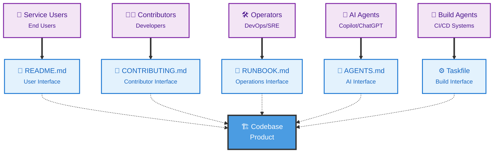

# 🎆 Welcome to Codebase Interface

## *The future of codebase collaboration starts here*

> 🌟 **Imagine a world** where every developer, operator, AI agent, and build system knows exactly how to interact with your codebase. Where onboarding takes minutes, not days. Where your code is as welcoming as your team.

The **Codebase Interface Initiative** is a set of principles and practices that transforms how we think about codebases. Instead of treating them as mere collections of files, we treat them as **products with multiple consumers** - each deserving a great experience.

## 🚀 Your Learning Journey

### 👤 Service Consumers

### 🧑‍💻 Contributors
Developers who improve your code

### 🛠️ Operators
DevOps/SRE who deploy & maintain

### 🤖 AI Agents
Copilot, ChatGPT, and other AI tools

### 🚀 Build Agents
CI/CD systems and automation

## 🗺️ Your Learning Journey

**Start here** → **Understand the foundations** → **See it in action** → **Join the movement**

### 🎯 Step 1: Foundation
- **[Principles](./principles.md)** - The 8 core principles that drive everything
- **[Audiences](./audiences.md)** - Meet the 5 types of users

### 🔨 Step 2: Implementation  
- **[Interfaces](./interfaces.md)** - How to serve each audience
- **[Tooling](./tooling.md)** - Recommended tools & practices

### ✨ Step 3: Benefits
- **[Benefits](./benefits.md)** - Why this approach works
- **[Examples](./examples.md)** - Real implementations

### 🤝 Step 4: Community
- **[Contribute](./Contribute.md)** - Join our mission
- **[Presentations](https://codebaseinterface.org/presentations/)** - Share the knowledge 

## 🔮 The Big Picture

**🎆 The Vision:** Your codebase should be a welcoming, well-organized digital space where everyone knows their way around.

**🎨 The Method:** Create dedicated interfaces (files and practices) for each audience, just like a well-designed building has different entrances for different purposes.

**🏆 The Result:** Faster onboarding, better collaboration, AI-ready documentation, and happier teams.

### 🏭 Architecture Overview

Think of your codebase as a **digital building** with **dedicated interfaces** for each type of visitor:



## 🤝 Join the Movement

### 🌟 **Be Part of Something New**

> Thousands of developers are already transforming their codebases. Join us in making software development more welcoming and efficient for everyone!

**⭐ [Star on GitHub](https://github.com/codebase-interface/codebaseinterface) • 💬 [Join Discussions](https://github.com/orgs/codebase-interface/discussions)**

### 🏅 Show Your Support

If your codebase follows the Codebase Interface principles, help spread the word!

Choose the style that fits your project:

#### 🎆 **Recommended - Primary Badge**

[](https://codebaseinterface.org)

```markdown
[](https://codebaseinterface.org)

> This repository follows the **Codebase Interface Principles** — for a better experience for everyone who works with it.
```

#### 🚀 **Alternative Styles**

**Simple:** [](https://codebaseinterface.org)

**Footer:** *Follows the [Codebase Interface Principles](https://codebaseinterface.org).*
